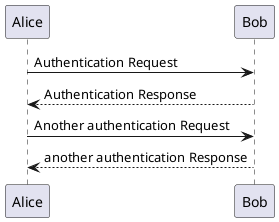

## Headline 

> An awesome project.

## docsify plugin: Flexible Alerts
> [!NOTE]
> An alert of type 'note' using global style 'callout'.

> [!TIP]
> An alert of type 'tip' using global style 'callout'.

> [!WARNING]
> An alert of type 'warning' using global style 'callout'.

> [!ATTENTION]
> An alert of type 'attention' using global style 'callout'.

> [!NOTE|style:flat]
> An alert of type 'note' using alert specific style 'flat' which overrides global style 'callout'.

> [!TIP|style:flat|label:My own heading|iconVisibility:hidden]
> An alert of type 'tip' using alert specific style 'flat' which overrides global style 'callout'.
> In addition, this alert uses an own heading and hides specific icon.

## docsify-gifcontrol
> [!NOTE]
> A docsify plugin that adds customizable player controls to GIFs. GIFs will play on hover or on click depending on your configuration.

## docsify-fontawesome
https://github.com/erickjx/docsify-fontawesome

## TimeLine
### Section X

